# LabNews

Somos un grupo conformado por gente comprometida y talentosa. Nuestra mision es servir al pais entregando informacion , entretenimiento y educacion a traves de contenidos de primera calidad  Puedes ver el demo del website haciendo click [aquí](https://labnewproyectofinal.herokuapp.com/).

## Resumen:

1. Se ***replico*** el diseño con las secciones de la Pagina Original.
2. Cuenta con las ***funcionalidades*** : carousel y boton del footer.
3. La pagina Web tiene es ***responsive*** : desktop y mobil.
4. Las noticias obtenidas son desde los ***end-point*** indicados.
5. Se realizo la aplicacion con el uso de ***componentes***.
6. Se utilizo GULP para la ***automatizacion de tareas***.
7. Los estilos se realizaron con la utilizacion del ***preprocesador SASS***.

## Secciones desarrolladas

| SECCION |SECCION |
| ---------- | ---------- |
| Barra superior   | Tecnologia   |
| Noticia principal   | Educacion   |
| Noticia secundaria  | Opinion   |
| Mundo  | Carrusel   |

## Responsive
__***Inicio***__
- Cuenta con una barra superior, el logo, el navbar y una noticia principal
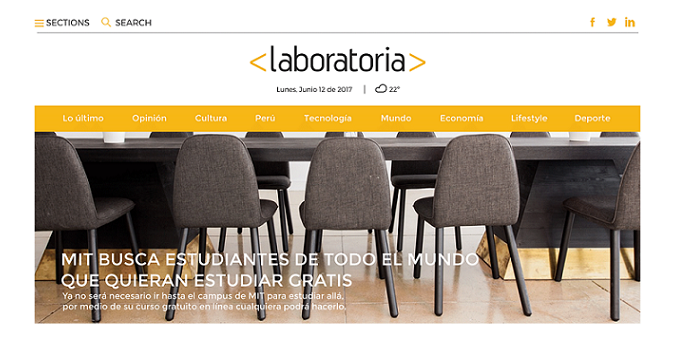
- Existen 3 noticias secundarias
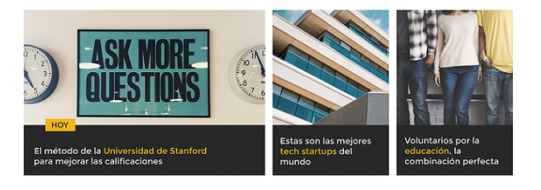
- En la **version responsive**, desaparece el navbar y se convierte en un menu hamburguesa. El logo pasa a la parte superior izquierda. La noticia principal y secundarias pasan a formar otra estructura.
 | 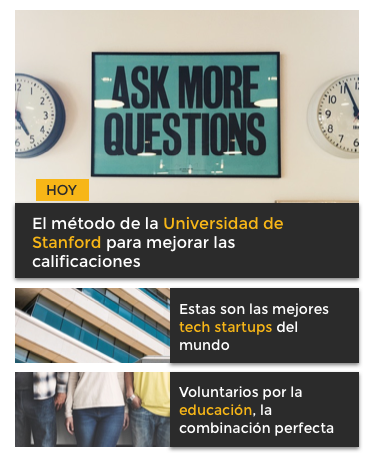

__***Mundo***__
- La seccion Mundo forma otra estructura en la version desktop.

__***Tecnologia***__
- La seccion Tecnologia forma otra estructura en la version desktop.
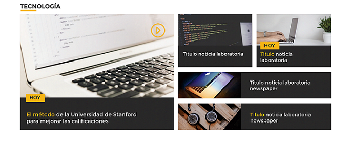

__***Mundo y Tecnologia - responsive***__
- En la **version responsive**, desaparece algunos item y otros llegan a formar una estructura diferente.
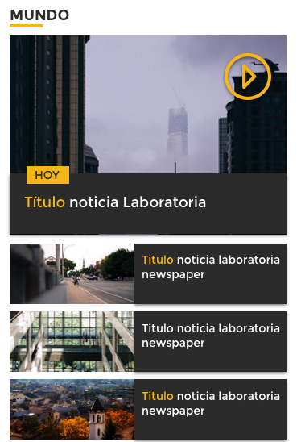 | 

__***Educacion***__
- La seccion Educacion forma otra estructura en la version desktop.
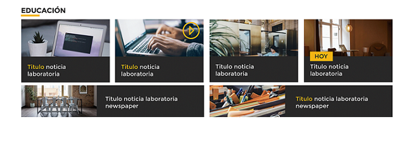

__***Opinion***__
- La seccion Opinion forma otra estructura en la version desktop.
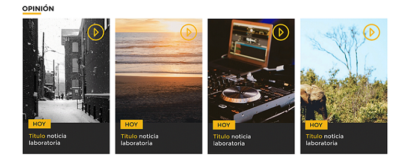

__***Educacion y Opinion - responsive***__
- En la **version responsive**, desaparece algunos item y otros llegan a formar una estructura diferente.
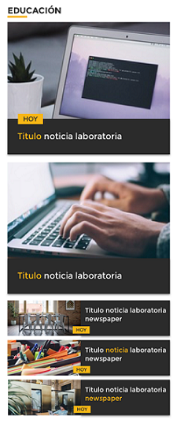 | 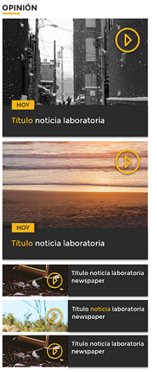

__***Carrusel***__
- La seccion Carrusel esta formado por 6 item y en la version responsive no aparece.

__***Footer***__
- Cuenta con 3 columnas y un boton a la derecha que te dirige al principio de la pagina.
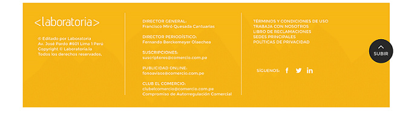
- En la vista responsive, el footer, tiene el logo al centro y un texto breve. El boton de  "subir" ya no aparece.
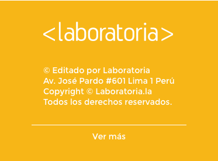

## Vistas:
1. Noticia LabNews:
- **Desktop** :Puedes verlo haciendo click [aquí](https://drive.google.com/file/d/0B6QwL6rGulDtVFN3dmFVSHNEVEk/view?usp=sharing).
- **Mobil** :Puedes verlo haciendo click [aquí](https://drive.google.com/file/d/0B6QwL6rGulDta2M5Vk1vOE1wTmM/view?usp=sharing).

2. Articulo LabNews:
- **Desktop** :Puedes verlo haciendo click [aquí](https://drive.google.com/file/d/0B6QwL6rGulDtdWRpMXB0S0JrUUk/view?usp=sharing).
- **Mobil** :Puedes verlo haciendo click [aquí](https://drive.google.com/file/d/0B6QwL6rGulDtX2pjV1loRW9KbTg/view?usp=sharing).
