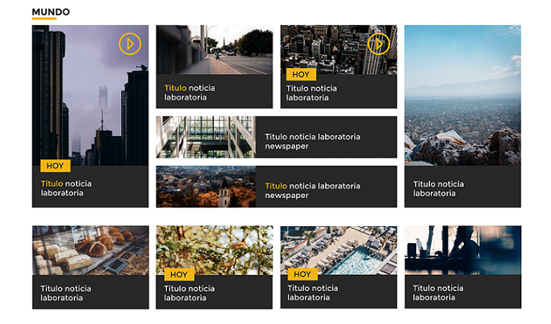

# LabNews

Somos un grupo conformado por gente comprometida y talentosa. Nuestra mision es servir al pais entregando informacion , entretenimiento y educacion a traves de contenidos de primera calidad  Puedes ver el demo del website haciendo click [aquí](https://labnewproyectofinal.herokuapp.com/).

## Secciones desarrolladas
- Barra superior
- Noticia principal
- Noticia secundaria
- Mundo
- Tecnologia
- Educacion
- Opinion
- Carrusel
- Footer

### Resumen:

1. Se *replico* el diseño con las secciones de la Pagina Original.
2. Cuenta con las *funcionalidades* : carousel y boton del footer.
3. La pagina Web tiene es *responsive* : desktop y mobil.
4. Las noticias obtenidas son desde los *end-point* indicados.
5. Se realizo la aplicacion con el uso de *componentes*.
6. Se utilizo GULP para la *automatizacion de tareas*.
7. Los estilos se realizaron con la utilizacion del *preprocesador SASS*.

### Vistas:
1. Noticia LabNews:
- **Desktop** :Puedes verlo haciendo click [aquí](https://drive.google.com/file/d/0B6QwL6rGulDtVFN3dmFVSHNEVEk/view?usp=sharing).
- **Mobil** :Puedes verlo haciendo click [aquí](https://drive.google.com/file/d/0B6QwL6rGulDta2M5Vk1vOE1wTmM/view?usp=sharing).

2. Articulo LabNews:
- **Desktop** :Puedes verlo haciendo click [aquí](https://drive.google.com/file/d/0B6QwL6rGulDtdWRpMXB0S0JrUUk/view?usp=sharing).
- **Mobil** :Puedes verlo haciendo click [aquí](https://drive.google.com/file/d/0B6QwL6rGulDtX2pjV1loRW9KbTg/view?usp=sharing).

## Responsive
### Inicio
- Cuenta con una barra superior, el logo, el navbar y una noticia principal
)
)
### Footer
- Cuenta con 3 columnas y un boton a la derecha que te dirige al principio de la pagina.

